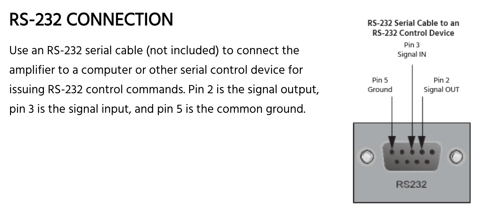

## Installation Amplifier

The [Monoprice 31028](https://www.monoprice.com/product?p_id=31028) is a 6 zone, 12 channel installation amplifier that is very powerful and versatile. Unlike its big brother the [Monoprice 10761](https://www.monoprice.com/product?p_id=10761), there are no wall controllers to configure the state of the channels. So in order to set the volume, balance, or EQ of a channel, RS232 is a requirement*.

_*The 31028 also supports IR control, but the controller must be physically rewired per zone and provides no feedback. So you could, in theory, change the volume settings, but would have no feedback as to what the current volume is..._

## Monoprice 31028 pinout

So RS232 control is a MUST, but how is it configured? Thankfully, both amplifiers at the very least have the same pinout, with this image taken straight from the [Monoprice 31028 user guide](https://downloads.monoprice.com/files/manuals/31028_Manual_180731.pdf):



## RS232 protocol

While both amplifiers have the same pinout, it turns out that their protocols are incompatible. Full details of the 10761 protocol can be found in the [Monoprice 10761 user guide](https://downloads.monoprice.com/files/manuals/10761_Manual_131209.pdf).

For example, to query the volume of zone 1 on the 10761, this command is sent:

```?11VO<CR>``` (hex `3f 31 31 56 4f 0d`)

While on the 31028, the same command looks like this:

```?1VO+``` (hex `3f 31 56 4f 2b`)

Note that the 10761 commands are terminated by a carriage return, while the 31028 commands are not.

More importantly, and this stumped for a while: the 10761 will echo back command characters whereas the 31028 *does not echo back command characters*. This caused me to question whether I had wired my serial cables correctly for quite some time as I can open a telnet session to the 10761 (through my digi terminal server) and type in commands, hit enter, and get responses back. For the 31028, typing in commands results in no visible feedback, and as the carriage return is not part of protocol there is not even an "unknown command" type error reported.

## Key Points

1. The Monoprice 10761 and 31028 use the same serial pinout
1. The devices use completely different protocols
1. The Monoprice 31028 does not echo back characters, and is otherwise silent unless it receives a complete and valid command
