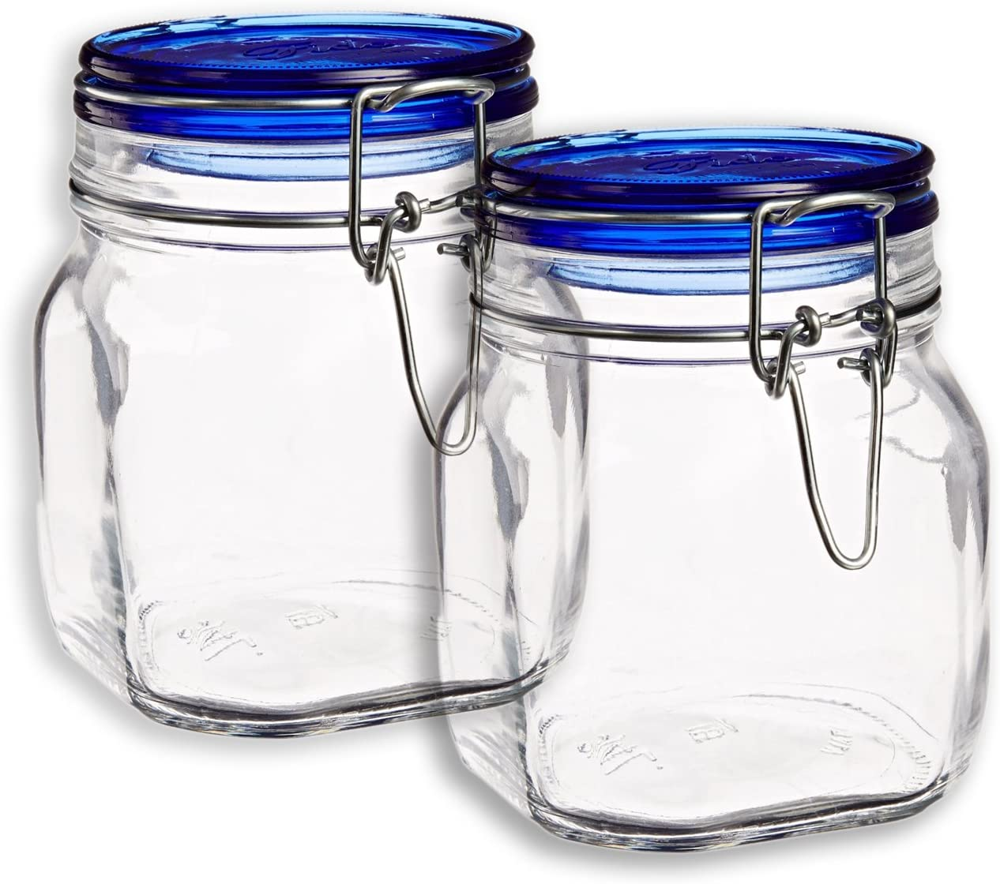
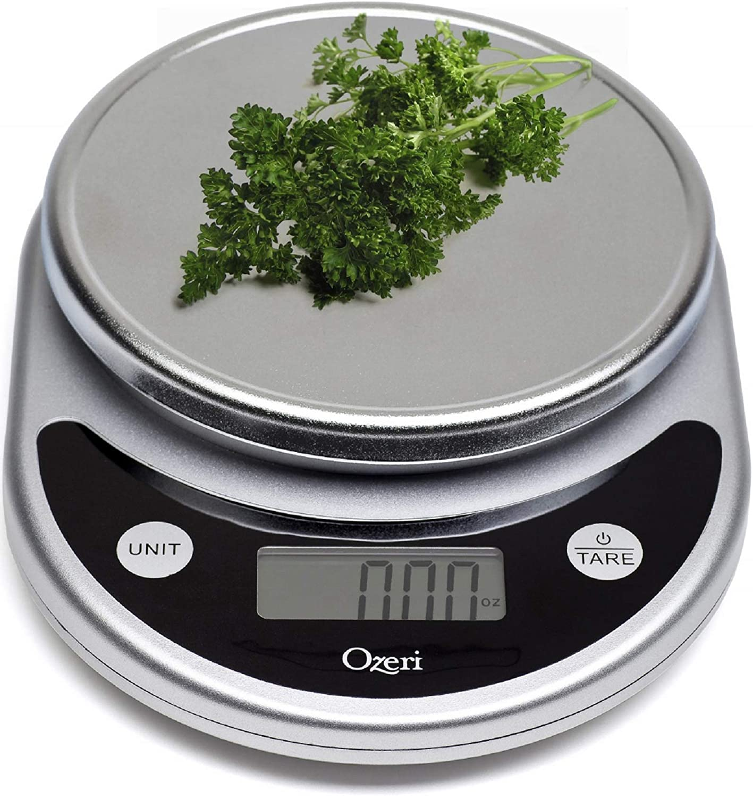
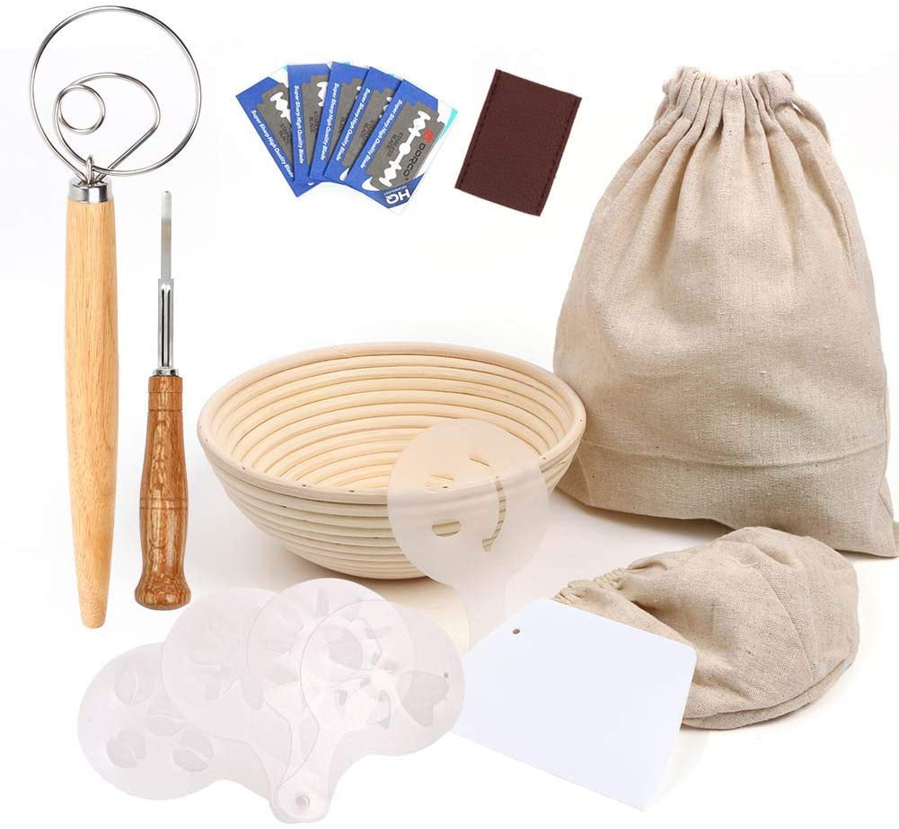

Earlier this year, my brother gifted me the obligation of a sourdough starter. With the new baby in the house, I had to take a crash course in nurturing and feeding.

## Getting Started

If you are trying to create a new starter, or looking for tips to keep one healthy, I recommend [this article](https://www.ilovecooking.ie/features/sourdough-bread-masterclass-with-patrick-ryan/) and companion video from Patrick Ryan which does a great job showing the process in action.

<iframe width="560" height="315" src="https://www.youtube.com/embed/2FVfJTGpXnU" frameborder="0" allow="accelerometer; autoplay; clipboard-write; encrypted-media; gyroscope; picture-in-picture" allowfullscreen></iframe>

## Gear

Once you are acquainted with the process, the issue becomes proper gear:

### Starter Jars

I love these [Bormioli Rocco Fido jars](/affiliate/amazon/B0118OIN8M) which are the perfect size for maintaining a starter, and it still fits in the fridge.

### Kitchen Scale

A kitchen scale is necessary for maintaining your starter and mixing precise bread recipes. [This Ozeri model](/affiliate/amazon/B004164SRA) has great reviews.

### Sourdough Tools

And once your starter is ready for primetime, there are certain tools necessary to make well formed sourdough. [This affordable starter kit](/affiliate/amazon/B07T1RCCVK) has the essentials:

* Proofing basket
* A lame
* Bowl scraper

## Good luck

Thats it! That is everything you need to know in order to get started and produce a loaf better than the one I made in the head of this post. Good luck, and keep experimenting!