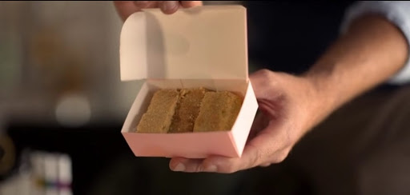
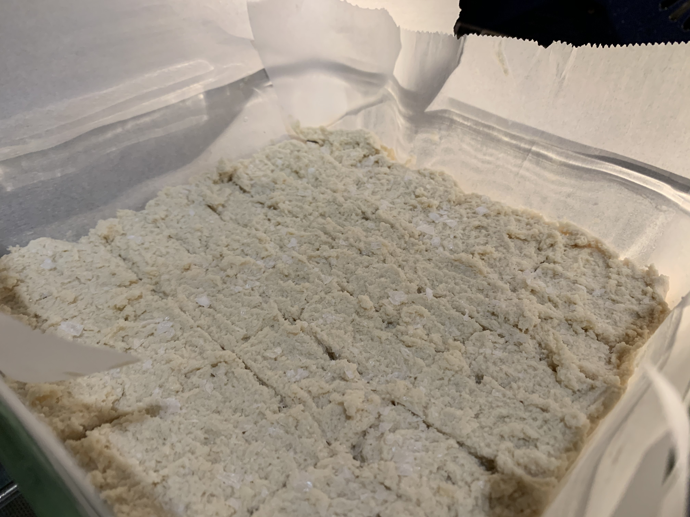
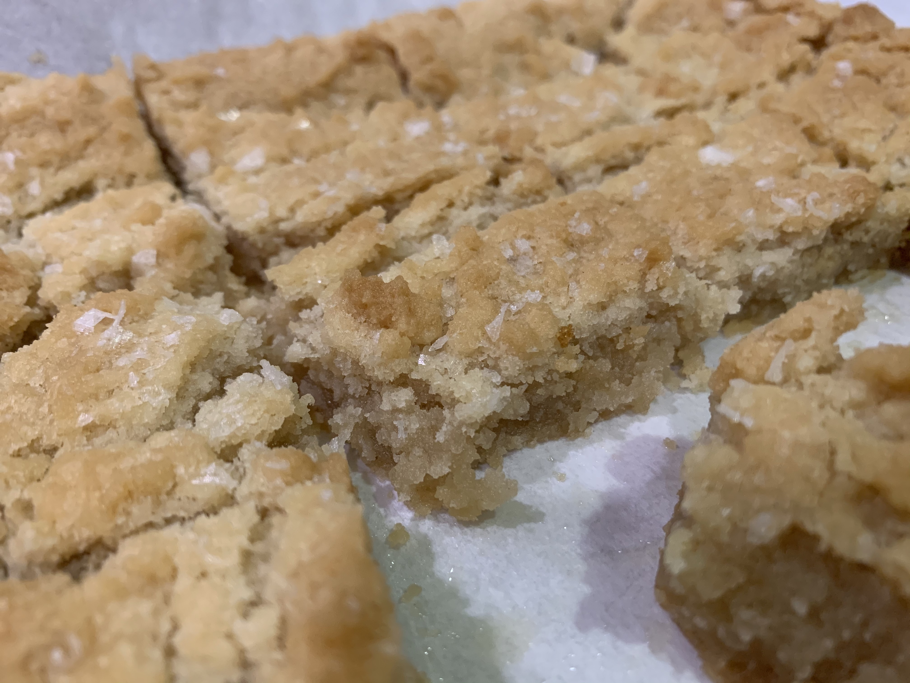

We discovered the brilliant Ted Lasso a few weeks ago and devoured the show. It is fun, funny, and uniquely positive. It is a show full of good people who all seem to be having some bad times.

But the real star of the show, are the English Biscuits that Ted gifts to Rebecca in the second episode.

Thanks to some other recipe hunters that I found online, these were identifed as Scottish Shortbread. I tried a few of these recipes and none of them quite hit the mark for me. But then I found a _genuine_ Scottish Shortbread recipe (or at least, as genuine as I can tell as an American who has never had Scottish Shortbread) and it came out near perfectly.

## Recipe

I modified the recipe a bit, both to match the asthetic of the show, and to brighten up the flavor a bit (the original recipe came out a bit bland).

### Ingredients

* 1 cup butter, softened
* 1 cup sugar
* 2 cups flour
* 1 tablespoon vanilla
* sea salt

### Instructions

1. Preheat the oven to 350 degrees.
1. Cream the butter and sugar until they are fluffy.
1. Add the vanilla.
1. Slowly incorporate the flour.
1. Pour dough into an 8x8 inch pan and flatten it until it is smooth.
1. Sprinkle with sea salt.
1. Bake for 40 minutes.
1. Then, turn off the oven and leave in for another 20 minutes.
1. Then, remove from oven and let rest in pan for 30 minutes.
1. THEN, you can carefully remove them from the pan.

